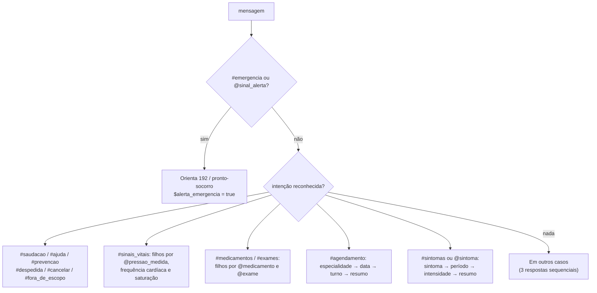

# Relatório da Frente 1 — Fluxo conversacional no Watson Assistant

**Projeto:** CardioIA Fase 5 — Assistente Cardiológico Inteligente  
**Frente:** 1 (Watson Assistant)  
**Referência didática:** PCV, Fase 5, Cap. 10, seção 1.6 "IBM Watson Assistant"

## 1. Objetivo e escopo

O CardioIA simula o atendimento inicial de um paciente cardiológico: acolhe, entende o que a pessoa relata,
organiza a informação e orienta o próximo passo. Não faz diagnóstico, não indica dose e não interpreta laudo.
Dor no peito, falta de ar intensa, desmaio ou sinais de AVC levam sempre à orientação de ligar 192.

A skill foi construída na experiência clássica (Dialog skill, português brasileiro), usando os quatro elementos do
material: intenções, entidades, árvore de diálogo e variáveis de contexto.

## 2. Intenções e entidades

**12 intenções, 140 exemplos** (10 a 13 por intenção): `#saudacao`, `#sintomas`, `#sinais_vitais`,
`#medicamentos`, `#exames`, `#agendamento`, `#prevencao`, `#emergencia`, `#ajuda`, `#cancelar`, `#despedida` e
`#fora_de_escopo`. A última intenção dá ao classificador exemplos negativos explícitos (placar, piada, dólar), em vez
de depender só da irrelevância.

**Entidades de dicionário** (fuzzy matching ligado, como no exemplo `@cidade`): `@sinal_alerta`, `@sintoma`,
`@sinal_vital`, `@medicamento`, `@exame`, `@periodo`, `@intensidade`, `@especialidade` e `@turno`, cada valor com
sinônimos da fala do paciente ("batedeira" → palpitação, "pulso" → frequência cardíaca).
**Entidade de padrão** (regex, fuzzy desligado, como no exemplo `@cep`): `@pressao_medida` reconhece "15 por 9" e
"140 x 90"; o texto digitado é guardado com `.literal`. **Entidades de sistema:** `@sys-number` e `@sys-date`.

## 3. Árvore de diálogo

Os nós da raiz são avaliados de cima para baixo. A ordem é parte do desenho:

1. **Bem-vindo** (`welcome`): apresenta o assistente, o menu e o aviso de simulação.
2. **Emergência** fica logo abaixo, para vencer qualquer outra intenção. Ela dispara pela intenção ou só pela
   entidade `@sinal_alerta`: "tenho sentido palpitação e aperto no peito" cai aqui, mesmo que o classificador escolha
   `#sintomas`.
3. **Sinais vitais** usa nós filhos com operadores numéricos. Para pressão, o primeiro `@sys-number` é a sistólica
   nos dois formatos ("15 por 9" ou "150 por 90"): ≥ 18/180 muito elevada, ≥ 14/140 elevada, < 9/90 baixa, senão na
   referência. Frequência cardíaca: fora de 40–150 bpm é preocupante; fora de 50–100 bpm, fora da referência.
   Saturação < 92% orienta atendimento. O último filho, `anything_else`, explica como enviar os valores.
4. **Medicamentos e exames** seguem o padrão "Caso São Paulo / Outras cidades" do material: um filho por valor
   de entidade e um `anything_else` com a orientação geral.
5. **Triagem de sintomas** e **agendamento** coletam três informações em sequência. Cada pergunta é um nó alcançado
   só por *jump to*, com três filhos:
   - **urgência** (`#emergencia` ou `@sinal_alerta`): pula para o nó Emergência;
   - **resposta reconhecida**: salva a entidade em variável de contexto (`$sintoma`, `$periodo`, `$intensidade`,
     `$especialidade`, `$data_consulta`, `$turno`) e pula para a próxima pergunta;
   - **outro assunto** (outra intenção com confiança acima de 0,6): pula para a condição do nó Emergência e reavalia
     a raiz, evitando a "toca do coelho" citada no material;
   - **anything_else**: avisa que não entendeu e repete a pergunta.

   A ordem veio do teste: respostas curtas como "forte" ou "amanhã" recebiam intenções fracas por acaso
   (`#cancelar` 0,23, `#saudacao` 0,28) e abandonavam o fluxo. Por isso a captura vem antes e a saída exige
   `intents[0].confidence > 0.6`.

   Se a primeira frase já traz a entidade ("estou com tontura", "quero marcar com cardiologista"), a pergunta
   correspondente é pulada. No fim, o **resumo** mostra os dados organizados. Intensidade forte recomenda avaliação no
   mesmo dia; sintoma com mais de uma semana sugere agendar consulta.
6. **Em outros casos** tem três variações sequenciais: pede para reformular, dá exemplos e, na terceira, mostra o menu
   e o 192.

## 4. Exemplo de conversa (triagem)

| Paciente | CardioIA | Nó |
|---|---|---|
| tenho sentido palpitação | Entendi: palpitação. Desde quando você sente isso? | Triagem → Perguntar período |
| faz uns dias | E qual a intensidade: leve, moderada ou forte? | Perguntar intensidade |
| forte | Resumo do que você relatou: sintoma palpitação, início há alguns dias, intensidade forte. Um sintoma forte merece avaliação presencial ainda hoje... | Resumo → Caso intensidade forte |

## 5. Tratamento de exceções

| Situação | Tratamento |
|---|---|
| Não entendeu | Três respostas sequenciais em "Em outros casos" |
| Resposta inválida no meio de um fluxo | `anything_else` do nó de pergunta repete com exemplo |
| Fora de escopo | `#fora_de_escopo` explica o escopo e mostra o menu |
| Urgência | `#emergencia` ou `@sinal_alerta` em qualquer ponto, inclusive no meio da triagem |
| Desistência | `#cancelar` interrompe o fluxo |
| Pedido de dose ou laudo | Resposta explícita de que não indica dose nem interpreta exame |

## 6. Integração e verificação

A skill é publicada no mesmo assistant consumido pela Frente 2. As respostas usam só texto, que o backend devolve em
`reply`, com a intenção e as entidades de cada turno. `scripts/validar_skill.py` confere a árvore sem rede;
`scripts/testar_fluxo.py` executa 10 conversas-roteiro pela API (emergência, triagem, urgência no meio da triagem,
sinais vitais, agendamento, cancelamento e exceções).

Verificação em 14/09/2026: a skill foi importada pela API como `cardioia-skill-teste` na instância do grupo (plano
Lite). A primeira rodada teve 21 de 28 turnos corretos; depois da reordenação descrita na seção 3, os **28 turnos
passaram**. Em seguida a `cardioia-skill` oficial (mesmo ID, ligada ao assistant do backend) foi atualizada com o
mesmo JSON e os roteiros passaram de novo (28/28).

## 7. Limitações

- Faixas de referência são gerais para adultos e servem apenas para orientar, não para diagnosticar.
- A classificação da pressão usa só a sistólica. "120/80" com barra pode ser lido pelo `@sys-number` como fração; por
  isso o assistente pede o formato "12 por 8".
- As variáveis de contexto se perdem ao fim da sessão, como descrito no material. A persistência fica com a Frente 5.
- O agendamento é simulado: nenhuma consulta real é marcada.
- Dois recursos vão além da seção do material: o limiar `intents[0].confidence` na saída dos fluxos e
  `reformatDateTime('dd/MM/yyyy')` para exibir a data do agendamento.
