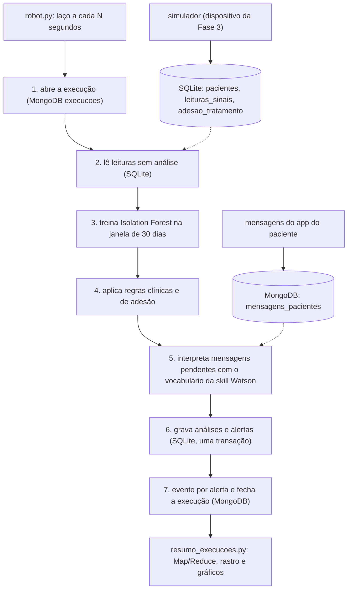
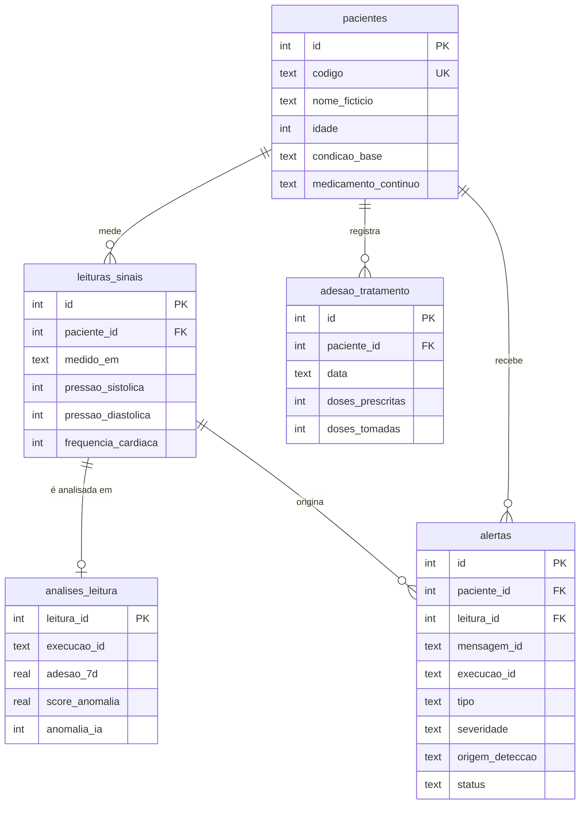
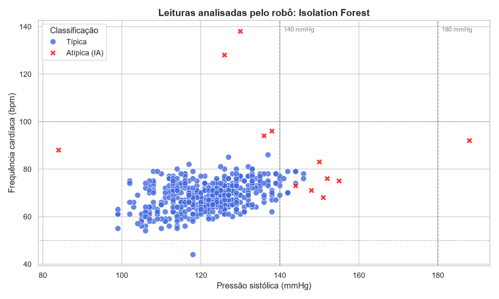
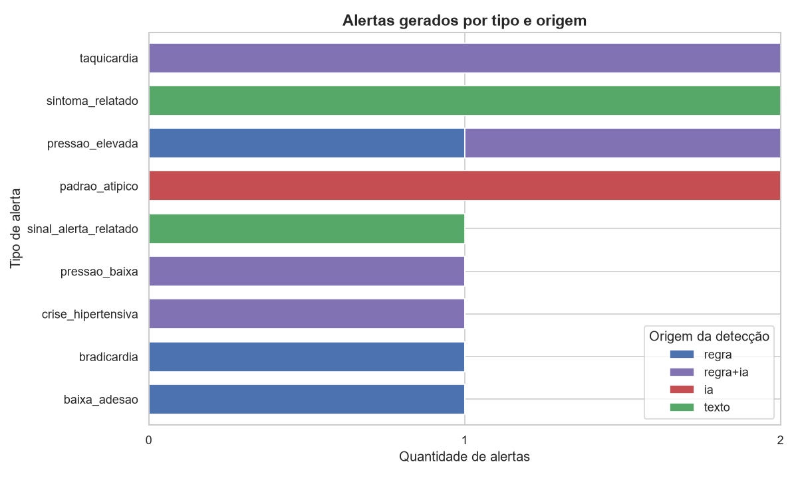

# Relatório técnico da Frente 5 — Ir Além 2: RPA, IA e dados híbridos

**Projeto:** CardioIA Fase 5 — Assistente Cardiológico Inteligente  
**Frente:** 5 (Ir Além 2)  
**Referência didática:** AIRPA, Fase 5, Cap. 2 "Do Banco de Dados à Automação Inteligente"; Governança, Cap. 7
"Confiar nos Dados Não É Sorte: É Governança"; PCV, Cap. 10 (entidades do Watson Assistant)  
**Código:** [`frente-5-ir-alem-2/`](../frente-5-ir-alem-2/README.md)

## 1. Objetivo e escopo

As Frentes 1 a 3 conversam com o paciente. Esta frente cuida do intervalo entre as conversas: um robô acompanha os
dados que o paciente registra em casa e avisa a equipe quando algo pede atenção, sem intervenção humana.

O robô:

- lê de tempos em tempos pressão arterial, frequência cardíaca e adesão ao tratamento guardadas em banco relacional;
- interpreta as mensagens de texto que os pacientes enviam;
- identifica situações de atenção com regras clínicas e com Isolation Forest;
- grava os alertas no banco relacional e registra execuções, eventos e mensagens no MongoDB, de modo que qualquer
  alerta possa ser reconstruído até o dado de origem.

Os dados são fictícios. O robô é uma simulação acadêmica e não substitui avaliação médica.

## 2. Fluxo automatizado



1. **Abertura.** Um `uuid4` vira o `execucao_id`. O documento em `execucoes` nasce com status `em_execucao`, os
   limiares das regras, os parâmetros do modelo, o hash do vocabulário e as versões de Python, SQLite, pandas,
   scikit-learn e pymongo.
2. **Leitura.** Um `SELECT` com `LEFT JOIN` em `analises_leitura` pega até 500 leituras ainda sem análise, da mais
   antiga para a mais nova. O dado bruto nunca é alterado: gravar a análise é o que marca a leitura como processada.
3. **Modelo.** A base de treino junta as leituras dos últimos 30 dias com as pendentes. O robô calcula os atributos,
   treina o Isolation Forest e pontua as pendentes. Com menos de 50 leituras o modelo não roda, o evento
   `modelo_nao_treinado` registra o motivo e as regras seguem valendo.
4. **Regras.** Cada leitura passa pelos limiares de pressão e frequência. Cada paciente com leitura nova passa pela
   regra de adesão dos últimos 7 dias.
5. **Mensagens.** As mensagens `pendente` são interpretadas. Mensagem de paciente fora do cadastro relacional vira
   `rejeitada`.
6. **Gravação.** Análises e alertas entram no SQLite em uma única transação (`with con:`).
7. **Registro.** Um evento `alerta_gerado` por alerta (com `alerta_id`, `leitura_id` ou `mensagem_id` e score), as
   mensagens recebem a interpretação e o `alerta_id`, e a execução fecha como `concluida`, com métricas e com os
   metadados do modelo treinado.

**Periodicidade.** `python robot.py --ciclos 3 --intervalo 10` roda três ciclos; `--ciclos 0` roda até Ctrl+C. É um
laço com `time.sleep`, como os robôs do material. Em produção, o agendador do sistema operacional chamaria o mesmo
ciclo.

**Falhas.** Se algo quebra no meio, a transação do SQLite não é confirmada, a execução fica com status `erro` (tipo e
mensagem da exceção) e as leituras continuam pendentes para o próximo ciclo. O robô não para por causa de um ciclo
com erro. Se o processo é derrubado, a execução que ficou `em_execucao` é marcada como `interrompida` quando o robô
volta. Reprocessar a mesma leitura ou mensagem não duplica alerta: `ON CONFLICT DO NOTHING` e índices únicos parciais
em `(leitura_id, tipo)` e `(mensagem_id, tipo)`.

## 3. Decisões de projeto

| Decisão | Escolha | Por quê | Descartado |
|---|---|---|---|
| Banco relacional | SQLite com `sqlite3` | Vem com o Python, não pede servidor e é ACID. O material o apresenta como banco natural de robôs RPA em Python | PostgreSQL: compensa quando vários robôs escrevem de máquinas diferentes |
| Modo de escrita | WAL e `synchronous=NORMAL` | O robô escreve enquanto o resumo lê. O material indica NORMAL para processos que toleram reprocessamento, que é o caso | Journal padrão (DELETE), com mais E/S por transação |
| Banco não relacional | MongoDB 6 em Docker | Cada tipo de evento tem campos diferentes; documento flexível, índice e Map/Reduce no servidor | Redis: guarda estado efêmero em memória, e o log do robô precisa durar e ser consultado |
| Divisão dos dados | SQLite: dado clínico, análises e alertas. MongoDB: execuções, eventos e mensagens | O que precisa de chave estrangeira, CHECK, transação e junção fica no relacional. Log semiestruturado e texto livre ficam no documental | Tudo no MongoDB, perdendo a integridade dos alertas |
| IA nos sinais vitais | Isolation Forest mais regras clínicas | Sem rótulos, rápido e usado no material para achar o que foge do padrão. A regra explica e cobre o que o modelo não isola | Só limiares, que não enxergam o que é atípico para aquele paciente |
| IA no texto | Entidades com sinônimos da skill Watson | Mesmo vocabulário do chatbot, sem credencial, rede ou cota do plano Lite | Chamar a API do Watson para cada mensagem |
| Datas | ISO 8601 em UTC | Compara como texto no SQLite e evita erro de fuso (consistência temporal, Cap. 7) | Horário local |
| Dados simulados | Semente fixa e medições às 8h e 20h UTC | O mesmo histórico sai a qualquer hora em que o ambiente for preparado | Horários relativos ao momento do preparo, que mudavam o resultado da IA |

## 4. Estrutura dos bancos

### 4.1 Relacional (SQLite)



| Tabela | Papel | Integridade |
|---|---|---|
| `pacientes` | Cadastro pseudonimizado | Código único, idade entre 18 e 110 |
| `leituras_sinais` | Dado bruto do monitoramento | Chave estrangeira, faixas fisiológicas, sistólica maior que diastólica, índice `(paciente_id, medido_em)` |
| `adesao_tratamento` | Doses por dia | Único por `(paciente_id, data)`, doses tomadas ≤ prescritas |
| `analises_leitura` | Resultado da análise de cada leitura | Chave primária = `leitura_id` (uma análise por leitura) |
| `alertas` | Fila de trabalho da equipe | CHECK de severidade, origem e status; índices únicos parciais para idempotência |

A DDL completa, com comentários, está em [`schema_relacional.sql`](../frente-5-ir-alem-2/schema_relacional.sql).

### 4.2 Não relacional (MongoDB)

| Coleção | Um documento por | Campos principais | Índices |
|---|---|---|---|
| `execucoes` | ciclo do robô | `_id` = `execucao_id`, `status`, `parametros`, `ambiente`, `metricas`, `modelo` | `inicio` (desc), `status` |
| `eventos` | ação do robô | `execucao_id`, `tipo`, `registrado_em`, `detalhes` (muda por tipo) | `(execucao_id, registrado_em)`, `tipo` |
| `mensagens_pacientes` | mensagem recebida | `paciente_codigo`, `texto`, `status`, `interpretacao`, `alerta_id` | `(status, recebida_em)` |

Exemplo real de evento:

```json
{
  "execucao_id": "6f247cd9-2eb0-4c6b-8dfa-9bb52131f9af",
  "tipo": "alerta_gerado",
  "registrado_em": "2026-09-15T22:51:31+00:00",
  "detalhes": {"alerta_id": 1, "tipo_alerta": "taquicardia", "severidade": "moderada",
               "origem_deteccao": "regra+ia", "paciente_codigo": "PAC-003", "leitura_id": 144, "score_anomalia": -0.054}
}
```

Os documentos completos de cada coleção estão em
[`estrutura_nosql.json`](../frente-5-ir-alem-2/estrutura_nosql.json). Um teste confere se as coleções e os índices
desse arquivo batem com o código.

O resumo de alertas por tipo usa Map/Reduce no servidor, como na seção 7.11 do material:

```javascript
map:    function () { emit(this.detalhes.tipo_alerta, 1); }
reduce: function (chave, valores) { var total = 0; for (var i = 0; i < valores.length; i++) { total += valores[i]; } return total; }
```

O comando é legado desde o MongoDB 5.0. Se o servidor recusar, o código usa o `$group` equivalente.

## 5. Técnicas de IA

### 5.1 Isolation Forest nos sinais vitais

O modelo segue o pipeline da seção 5 do Cap. 2: dados do SQLite em DataFrame, engenharia de atributos e
`IsolationForest` sem rótulos.

| Atributo | Cálculo | Por quê |
|---|---|---|
| `pressao_sistolica`, `pressao_diastolica`, `frequencia_cardiaca` | valor medido | sinais de entrada |
| `pressao_pulso` | sistólica − diastólica | razão clínica simples; o material diz que razões ajudam o modelo |
| `adesao_7d` | doses tomadas ÷ prescritas no dia e nos 6 anteriores | liga comportamento e sinal |
| `desvio_sistolica`, `desvio_diastolica`, `desvio_fc` | valor − mediana do próprio paciente | normalização por paciente |

Parâmetros: 200 árvores (faixa de 100 a 300 do material), semente 42, mínimo de 50 leituras e contaminação de 2,5%.

**Calibração da contaminação.** O material sugere começar entre 5% e 10% e ajustar depois de inspecionar os achados.
Na base simulada (480 leituras, 5 eventos agudos e 2 leituras atípicas planejadas):

| Contaminação | Leituras marcadas pela IA | Alertas só da IA | Eventos agudos confirmados pela IA |
|---|---|---|---|
| 5% | 24 | 6 (4 sem nada clínico, score entre −0,05 e 0) | 4 de 5 |
| 4% | 20 | 4 | 4 de 5 |
| 3% | 15 | 3 (1 com score −0,0035) | 4 de 5 |
| **2,5%** | **12** | **2 (as planejadas, scores −0,082 e −0,068)** | **4 de 5** |
| 2% | 10 | 2 (as planejadas, scores −0,044 e −0,030) | 4 de 5 |

Com 2,5% saem só as duas leituras atípicas planejadas, com mais folga que em 2%. É o ajuste que o material recomenda
quando há falso positivo demais.

**Efeito da engenharia de atributos.** Mesma base, mesma contaminação, com e sem os desvios em relação ao paciente:

| Atributos | Leituras atípicas do PAC-007 (138/88, FC 96 e 136/86, FC 94) | Alertas só da IA | Eventos agudos confirmados |
|---|---|---|---|
| 8, com desvio | detectadas (score −0,082 e −0,068) | as 2 planejadas | 4 de 5 |
| 5, sem desvio | não detectadas (score +0,029 e +0,037) | 1 leitura sem nada clínico (99/70, FC 55) | 3 de 5 |

Sem o desvio, 138/88 parece normal porque outros pacientes vivem nessa faixa. Com o desvio, o modelo vê que o
PAC-007 costuma ficar em 110/70 com FC 61.

### 5.2 Regras clínicas

As faixas são as mesmas que o assistente da Frente 1 usa nas respostas (pressão a partir de 18 por 9 muito elevada,
a partir de 14 por 9 elevada, abaixo de 9 baixa, frequência entre 50 e 100 bpm). A diastólica entra como complemento.

| Tipo | Condição | Severidade | Natureza |
|---|---|---|---|
| `crise_hipertensiva` | sistólica ≥ 180 ou diastólica ≥ 120 | crítica | evento agudo |
| `pressao_baixa` | sistólica < 90 ou diastólica < 60 | alta | evento agudo |
| `taquicardia` | FC > 100 (≥ 130 vira alta) | moderada ou alta | evento agudo |
| `bradicardia` | FC < 50 | alta | evento agudo |
| `padrao_atipico` | só o Isolation Forest marcou | moderada | evento agudo |
| `pressao_elevada` | sistólica ≥ 140 ou diastólica ≥ 90 | moderada | estado persistente |
| `baixa_adesao` | adesão em 7 dias < 80% | moderada | estado persistente |

**Evento agudo** gera um alerta por leitura. **Estado persistente** gera no máximo um alerta por paciente a cada 24 h,
com a leitura mais recente e a contagem das demais. Na base simulada, as 25 leituras acima de 140/90 viraram 2
alertas (21 do PAC-002 durante a queda de adesão e 4 do PAC-001). Sem essa regra, a equipe receberia 25 alertas
repetidos, que é como a fadiga de alerta começa.

### 5.3 Interpretação das mensagens

O robô carrega 71 termos das entidades `@sinal_alerta`, `@sintoma` e `@medicamento` do JSON da skill Watson e grava o
hash do arquivo em cada execução. O processamento:

1. normaliza o texto (minúsculas, sem acento);
2. casa termos inteiros, do mais longo para o mais curto, sem sobreposição: "muita falta de ar" é sinal de alerta e
   não conta de novo como o sintoma "falta de ar"; "fracasso" não casa com "fraca";
3. trata negação simples: "não", "sem", "nunca" até três palavras antes do termo, dentro da mesma oração. "sem dor no
   peito" é negação; "Não, estou com dor no peito" é relato.

| Mensagem simulada | Resultado | Alerta |
|---|---|---|
| PAC-004: "Ontem à noite senti um aperto no peito e fiquei suando frio." | sinal de alerta: dor no peito | crítico, orienta 192 |
| PAC-003: "Coração disparado de novo depois do café." | sintoma: palpitação | moderado |
| PAC-005: "Fiquei tonta quando levantei da cama." | sintoma: tontura | moderado |
| PAC-002: "Acabou a losartana e fiquei uns dias sem tomar." | medicamento: losartana | nenhum (a baixa adesão já aparece nos dados) |
| PAC-001: "Hoje estou bem, sem dor no peito e sem falta de ar." | negados: dor no peito, falta de ar | nenhum |
| PAC-007: "Queria confirmar o horário da consulta." | nada | nenhum |
| PAC-099: "Oi, recebi o aparelho de pressão, como começo?" | paciente fora do cadastro | mensagem rejeitada |

### 5.4 Como as camadas se combinam

| `origem_deteccao` | Significado |
|---|---|
| `regra` | limiar cruzado e o modelo não marcou a leitura |
| `regra+ia` | limiar cruzado e o Isolation Forest também marcou: um único alerta, com o score |
| `ia` | nenhum limiar cruzado, mas a leitura foge do padrão: alerta `padrao_atipico` |
| `texto` | alerta vindo de mensagem do paciente |

## 6. Resultados

### 6.1 Primeiro ciclo: histórico de 30 dias

`python preparar_ambiente.py --reset` seguido de `python robot.py --ciclos 1`. O resultado se repete a cada rodada:
480 leituras analisadas, 12 marcadas pela IA (2,5%), 6 mensagens interpretadas, 1 rejeitada e **13 alertas em 0,23 s**.

| # | Paciente | Tipo | Severidade | Origem | Evidência |
|---|---|---|---|---|---|
| 1 | PAC-003 | taquicardia | moderada | regra+ia | FC 128 bpm, score −0,054 |
| 2 | PAC-008 | bradicardia | alta | regra | FC 44 bpm, score +0,074 |
| 3 | PAC-005 | pressao_baixa | alta | regra+ia | 84/54 mmHg, score −0,115 |
| 4 | PAC-003 | taquicardia | alta | regra+ia | FC 138 bpm, score −0,059 |
| 5 | PAC-004 | crise_hipertensiva | crítica | regra+ia | 188/112 mmHg, score −0,173 |
| 6 | PAC-007 | padrao_atipico | moderada | ia | 138/88, FC 96 (mediana 110/70, FC 61) |
| 7 | PAC-007 | padrao_atipico | moderada | ia | 136/86, FC 94 |
| 8 | PAC-001 | pressao_elevada | moderada | regra | 146/86 mmHg, 4 leituras acima da referência |
| 9 | PAC-002 | pressao_elevada | moderada | regra+ia | 144/96 mmHg, 21 leituras acima da referência |
| 10 | PAC-002 | baixa_adesao | moderada | regra | 25% em 7 dias (3 de 12 doses) |
| 11 | PAC-003 | sintoma_relatado | moderada | texto | palpitação |
| 12 | PAC-005 | sintoma_relatado | moderada | texto | tontura |
| 13 | PAC-004 | sinal_alerta_relatado | crítica | texto | dor no peito |

O que a tabela mostra:

- Regra e IA concordam em 4 dos 5 eventos agudos.
- **Só a IA** achou as leituras do PAC-007: abaixo de todos os limiares, mas distantes do padrão do paciente.
- **Só a regra** achou a bradicardia do PAC-008 (FC 44, score positivo). Com pressão normal, uma frequência 20 bpm
  abaixo da mediana não bastou para isolar a leitura. Por isso as duas camadas ficam juntas.
- O PAC-004 teve crise hipertensiva nos dados e relatou aperto no peito na mensagem: dois alertas críticos de origens
  diferentes para o mesmo paciente.
- O PAC-002 parou o remédio e a pressão subiu aos poucos: um alerta de pressão elevada (21 leituras) e um de baixa
  adesão, em vez de 21 avisos soltos.





Na dispersão, os pontos vermelhos abaixo das linhas de 140 mmHg e 100 bpm são os que só a IA viu; o ponto azul
em 44 bpm é a bradicardia que só a regra viu.

### 6.2 Ciclos seguintes

`python robot.py --ciclos 3 --intervalo 5 --simular-chegada 4`: a cada 5 s chegam 4 leituras novas e o robô analisa
só elas (0,19 s a 0,27 s por ciclo, com o modelo retreinado na janela). No segundo ciclo chegou uma crise do PAC-006
(190/111 mmHg), confirmada pela IA. Esses números mudam a cada rodada, porque as chegadas são sorteadas.

## 7. Rastreabilidade e governança

Qualquer alerta pode ser seguido até a origem com `python resumo_execucoes.py --alerta <id>`. Saída real, resumida:

```text
Rastro do alerta 6
[SQLite] alertas             padrao_atipico | severidade moderada | origem ia | status aberto
[SQLite] pacientes           PAC-007 (hipertensão, uso contínuo de enalapril)
[SQLite] leituras_sinais     leitura 414 medida em 2026-09-11T20:00:00+00:00: PA 138/88 mmHg, FC 96 bpm
[SQLite] analises_leitura    score -0.0818 | anomalia_ia 1 | adesão 7 dias 0.8571
[MongoDB] execucoes          0043d2d3-... | concluida | robô 1.0.0 | regras 1.0.0
                             IsolationForest | contaminação 0.025 | 480 amostras | hash dos dados f234a0350feec298
[MongoDB] eventos            leituras_lidas: quantidade=480
                             modelo_treinado: n_estimadores=200, semente=42, versao_scikit_learn=1.9.1, hash_dataset=...
                             alerta_gerado: alerta_id=6, leitura_id=414, score_anomalia=-0.0818
```

Os princípios do Cap. 7 aparecem assim:

| Princípio | No robô |
|---|---|
| Rastreabilidade | `execucao_id` em todos os registros, hash SHA-256 dos dados de treino, versões das bibliotecas e hash da skill Watson. Duas rodadas em horários diferentes geraram o mesmo hash (`f234a035…`) e os mesmos 13 alertas |
| Consistência temporal | UTC em ISO 8601 e janelas fixas (30 dias de treino, 7 de adesão, 24 h para estados), gravadas em cada execução |
| Transparência | Cada alerta diz o limiar cruzado ou a comparação com a mediana do paciente; as limitações estão na seção 10 |
| Segurança by design | Pacientes com código e nome fictício; eventos guardam as entidades encontradas, não o texto da mensagem; credenciais no `.env`; MongoDB publicado só em `127.0.0.1`; material didático e credenciais fora do Git |
| Operabilidade | Status por execução (`concluida`, `erro`, `interrompida`), duração e métricas; um ciclo com erro não derruba o robô |

## 8. Testes

São 110 testes com pytest: 107 rodam sem Docker (SQLite temporário e `mongomock`) e 3 rodam contra o MongoDB 6.0.28
do `docker-compose` (Map/Reduce no servidor, datas em UTC e ciclo completo). Eles cobrem limiares nas bordas, negação
e sobreposição de termos, o Isolation Forest (outlier, desvio do paciente e reprodutibilidade), transação e
idempotência no SQLite, o ciclo (regra+ia, ia, adesão a cada 24 h, mensagens, falha e rastro), a simulação completa,
os comandos de terminal e a coerência entre `estrutura_nosql.json` e os índices do código.

Três problemas foram achados pelos testes e corrigidos antes da entrega:

1. a negação atravessava vírgula e "Não, estou com dor no peito" deixava de gerar alerta crítico;
2. o horário em que o ambiente era preparado mudava a data das leituras simuladas e, com ela, o resultado da IA;
3. a pressão elevada gerava 25 alertas repetidos, o que levou à regra de estado persistente.

## 9. Integração com as outras frentes

- **Frente 1:** o vocabulário de texto sai direto de `cardioia-skill.json`, e os limiares seguem as respostas do
  assistente.
- **Frentes 2 e 3:** `mensagens_pacientes` aceita `session_id` e `intent`, os campos que o `POST /api/chat` devolve.
  Gravar os turnos do chat nessa coleção é o próximo passo natural.
- **Frente 4:** o JSON da extração clínica poderia entrar como metadado da mensagem. Não foi implementado.
- **Fase 3:** os sinais simulados seguem o cenário de monitoramento em casa.

## 10. Limitações e próximos passos

- Dados simulados e limiares gerais para adultos, sem ajuste por prescrição de cada paciente.
- O Isolation Forest foi calibrado na base simulada. Em dados reais, os alertas precisariam de validação com a equipe
  clínica, e os confirmados ou descartados (campo `status`) poderiam realimentar a calibração, como o material sugere.
- A interpretação de texto não tem fuzzy match e só trata negação simples.
- O SQLite aceita um escritor por vez. Vários robôs em máquinas diferentes pediriam PostgreSQL.
- Map/Reduce é legado no MongoDB; o pipeline de agregação equivalente já está pronto no código.

## 11. Como reproduzir

```bash
cd frente-5-ir-alem-2
pip install -r requirements.txt
docker compose up -d
python preparar_ambiente.py --reset
python robot.py --ciclos 1
python resumo_execucoes.py --alerta 6
pytest -q
```
